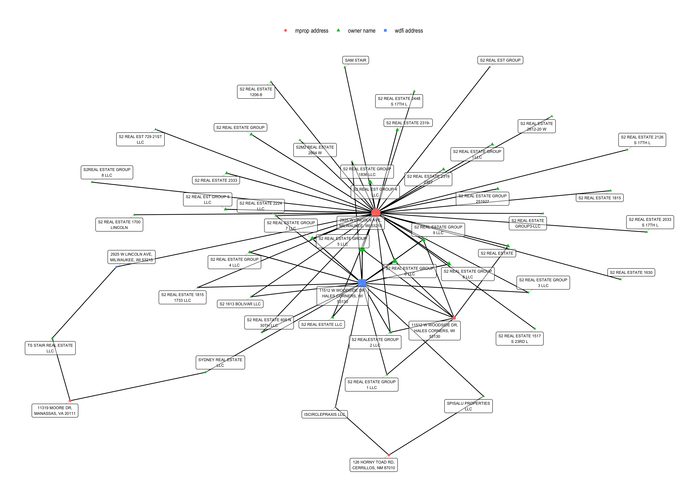

# mke-owner-networks

This repository includes data and code for identifying networks of connected landlords in the City of Milwaukee.

Visit to [https://www.mkepropertyownership.com/](https://www.mkepropertyownership.com/) to see it in action!

## data processing workflow

## network nodes and edges

The owner networks are constructed with 3 kinds of nodes and 3 corresponding types of edges, or connections between the nodes.

### kinds of nodes

   * mprop owner (also WDFI corp registration, when matched)
   * mprop address (owner mailing address)
   * wdfi address (principal office address from matched corporate registration)

### kinds of connections (graph edges)
   * mprop owner TO mprop address  - via each row of the MPROP parcel file
   * mprop owner TO wdfi address   - via mprop owner to wdfi corp direct match, then use wdfi principal office address
   * mprop address TO wdfi address - the MPROP address exactly matches the WDFI principal office address

The resulting network graphs can be visualized using any network graphing software. See `analysis-scripts/VisualizeNetworkGraphs.R` for an implementation using the R package {{ggraph}}.

The result looks like this for the S2 Real Estate Group network.

